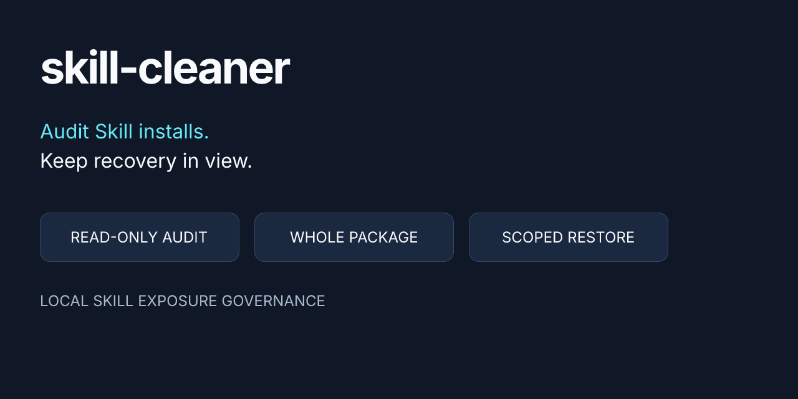
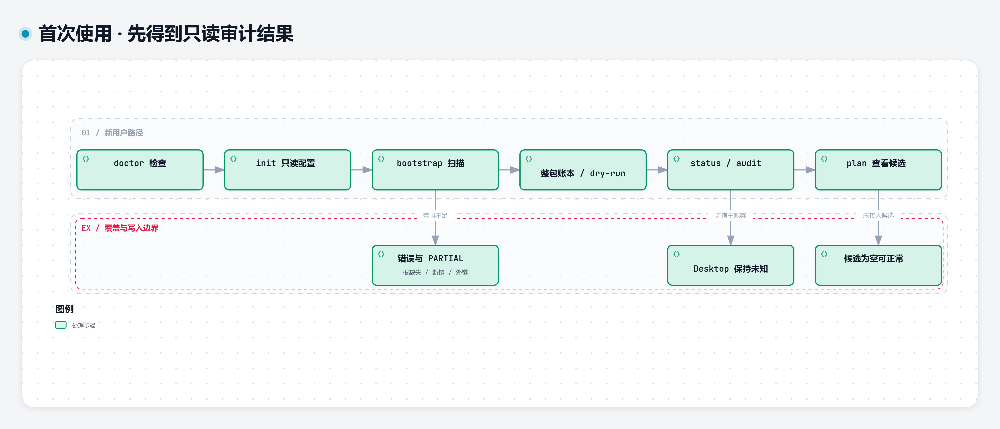
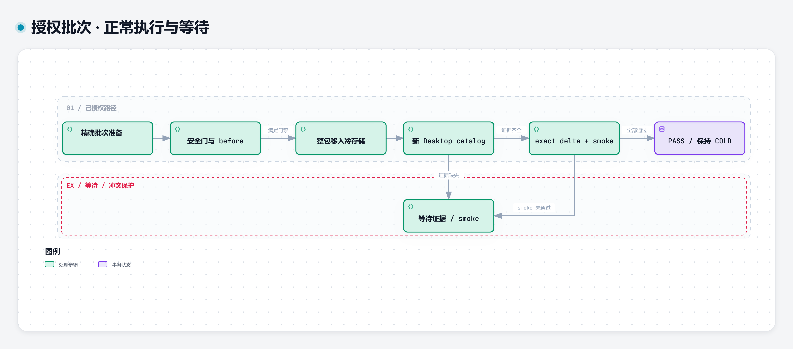
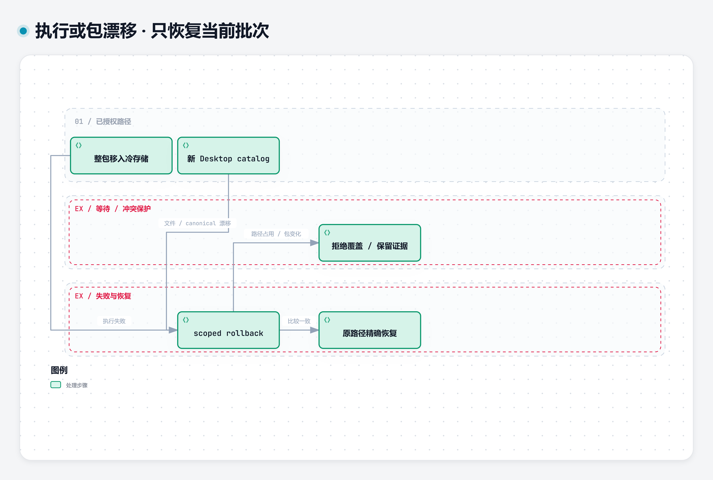
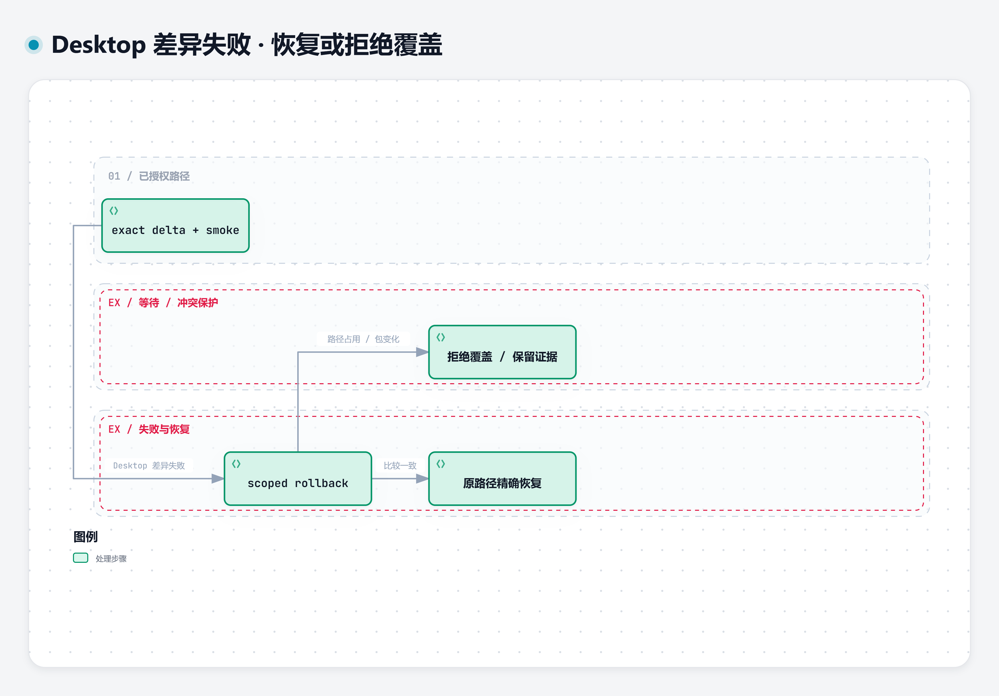
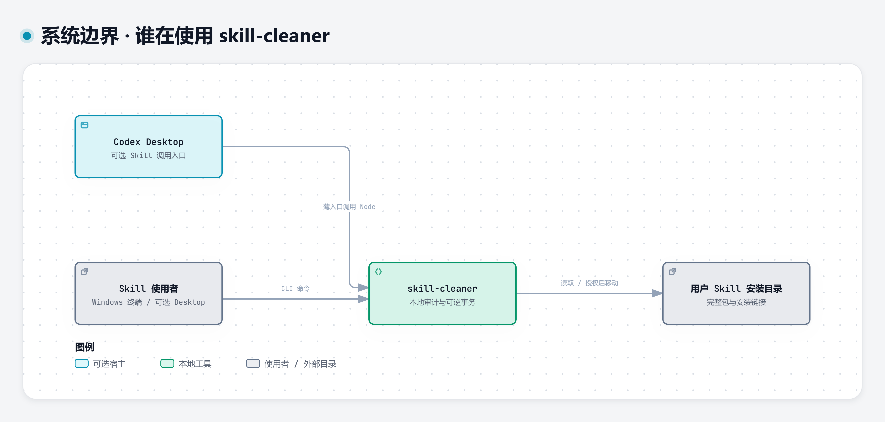
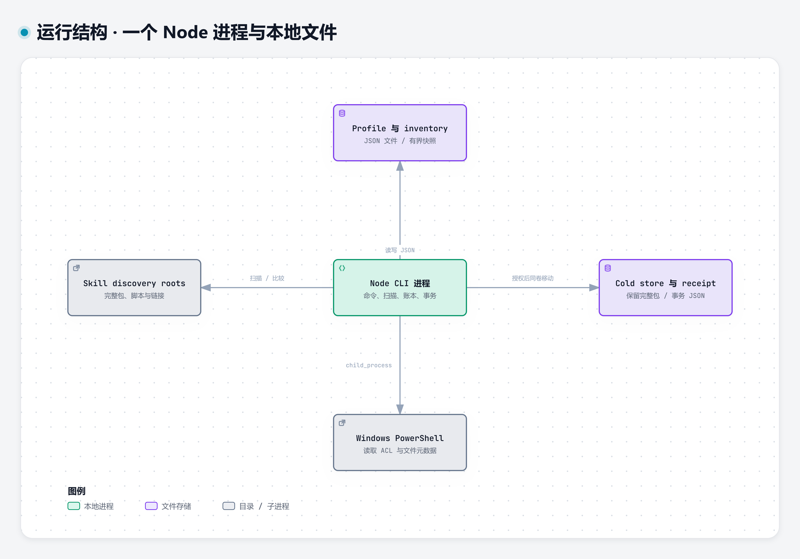

<h1 align="center">skill-cleaner</h1>

<p align="center">审计本机 Agent Skill 的安装与发现入口，为已确认的冗余包提供可回滚的冷存储变更。</p>

<p align="center">
  
</p>

装了很多 Skill，却不知道哪些只是别名、哪些已经过时、哪些仍被项目使用？你提供用户 Skill 根目录和本机配置，得到带扫描范围的 inventory、整包冲突账本和只读方案。符合证据与授权条件的变更保留完整包、原路径和事务记录，便于恢复。

适合需要梳理本机 Skill 安装的开发者。项目内部简称 SGS；可选的 Codex 入口仍叫 `skill-governance`。默认先审计，首次部署不会移动你的 Skill。

## 本页导航

[能做什么](#能做什么) · [工作流程](#工作流程) · [系统架构](#系统架构) · [安装与首次使用](#安装与首次使用) · [命令](#命令) · [配置与搬家](#配置与搬家) · [安全与恢复](#安全与恢复) · [限制与常见问题](#限制与常见问题) · [验证与许可证](#验证与许可证)

## 能做什么

| 你的问题 | 可以做什么 | 得到什么 |
|---|---|---|
| 不清楚到底安装了哪些包 | 扫描配置的用户根目录，记录链接和扫描错误 | 逻辑入口、真实目标、包身份分别计数的 JSON inventory |
| 同名 Skill 是否真重复 | 比较整包文件、内容与链接关系 | canonical / conflict ledger；同名不同包单独列出 |
| 想先看影响再动手 | 运行只读 bootstrap 与 plan | 账本、行动分类和 dry-run；推荐减少与实际减少分开 |
| 已确认冗余，仍担心丢包 | 对精确授权的安装入口执行冷存储事务 | 完整包、before state、恢复路径与 receipt |
| 改动中发生漂移或冲突 | 对照 before/canonical 状态，使用锁和 scoped rollback | 拒绝覆盖并发改动；可恢复的失败恢复原路径 |
| 希望在 Codex 会话中使用 | 安装薄入口；项目搬家后 rebind | `$skill-governance` 调用同一个本地 CLI |

**与手工搬目录相比**，它同时维护包身份、原路径、事务状态和恢复比较。**与只比较 `SKILL.md` 的脚本相比**，它还检查 `scripts/`、`references/`、`assets/` 和内部链接。它不会用“同名”或“零读取”作为默认删除理由，也不保证仅靠扫描就能判断所有项目依赖。

## 工作流程

### 先得到一份只读审计



`doctor` 检查环境与路径边界；`init` 创建只读配置；`bootstrap` 调用 scanner、包指纹和账本，保存快照；`status` / `audit` 读取这些结果。缺失根、断链和未允许的外部链接会出现在 errors 中，结果可能为 `PARTIAL`。没有 Desktop 直接观察时，Exposure 保持未知。新用户 `plan` 为空可以是正常结果。

[下载交互图](assets/diagrams/onboarding.html) · [编辑图源](assets/diagrams/onboarding.json) · [双主题矢量图](assets/diagrams/onboarding.svg)

### 已授权后才移动，验证后才算完成



准备批次不会执行搬移。通过宿主绑定、精确授权、整包 canonical、before 比较与同卷检查后，才移动完整安装包。文件系统移动成功先处于 `APPLIED_AWAITING_DESKTOP`；新鲜的同宿主 catalog、exact-path delta 和 canonical/core smoke 全部满足后才为 `PASS`。执行失败或无法解释的 Desktop 差异会尝试回滚当前批次；缺少观察证据或 smoke 尚未通过则等待；smoke 未通过本身不触发自动回滚。

[下载交互图](assets/diagrams/transaction.html) · [编辑图源](assets/diagrams/transaction.json) · [双主题矢量图](assets/diagrams/transaction.svg)

### 出错后如何保住包



移动执行失败或验收时发现文件/canonical 漂移，会尝试恢复当前批次。恢复必须通过当前状态比较；占用原路径的后续改动不会被覆盖。

[下载交互图](assets/diagrams/recovery-package.html) · [编辑图源](assets/diagrams/recovery-package.json) · [双主题矢量图](assets/diagrams/recovery-package.svg)



新 catalog 的精确差异无法解释时也回滚当前批次。这个分支针对 Desktop delta 失败；smoke 未通过本身仍留在等待检查状态。恢复不能完成则保留 receipt 并进入 RECOVERY_REQUIRED。

[下载交互图](assets/diagrams/recovery-desktop.html) · [编辑图源](assets/diagrams/recovery-desktop.json) · [双主题矢量图](assets/diagrams/recovery-desktop.svg)

交互图是自包含 HTML：下载后在浏览器中打开，可查找节点、切换明暗主题并查看源码来源。GitHub 的 HTML 文件页不会直接运行交互图；本页的图片已经覆盖必要说明。

## 系统架构

### 系统边界



终端用户直接运行 CLI；Codex Desktop 可通过 `skill-governance` 薄入口调用它。Desktop 是外部宿主，扫描不能替代该宿主的 Skill selector 或实际会话 catalog 观察。

[下载交互图](assets/diagrams/context.html) · [编辑图源](assets/diagrams/context.json) · [双主题矢量图](assets/diagrams/context.svg)

### 运行结构与技术职责



这是本地工具：**一个 Node CLI 进程、本地 JSON 和文件目录**。没有服务端、数据库服务或需要部署的 Web UI。scanner、ledger、authorization 和 backend 是进程内模块。

| 技术 / 模块 | 实际职责 |
|---|---|
| Node.js 24+ / ESM | 运行命令、扫描、配置解析和事务；运行依赖只有 Node 内置模块 |
| `node:fs` / `node:path` | 读取安装链接、发布快照、同卷 rename、精确恢复路径 |
| `node:crypto` / SHA-256 | 包内容、文件、链接与 before state 身份比较 |
| Windows PowerShell | 读取 ACL、属性和链接类型，纳入事务快照 |
| scanner → fingerprint → ledger | 保留覆盖和错误，将同目标、同入口、同包和同名不同内容区分开 |
| FilesystemExposureBackend | 单路径锁、before/canonical 比较、整包冷存、冲突拒绝与恢复 |
| JSON profile / inventory / receipt | profile 选择宿主和路径；inventory 是快照；receipt 是事务状态来源 |
| Codex 薄入口（可选） | 保存 Node executable、项目路径和 config pointer，调用独立项目 |

[下载交互图](assets/diagrams/containers.html) · [编辑图源](assets/diagrams/containers.json) · [双主题矢量图](assets/diagrams/containers.svg) · [C4 可编辑源与兼容渲染](docs/architecture/README.md)

三种对象不能混为一谈：**Asset** 是完整包；**Installation** 是一个具体安装路径及链接关系；**Exposure** 是宿主实际观察到的入口。文件系统计数不是 Desktop 全局可见总数。

## 安装与首次使用

需要 **Windows、Node.js 24+ 和系统 Windows PowerShell**。无需 `npm install`。完整文件事务在 Windows 上验证；其他平台的生产写入被拒绝。

### 获取项目

下载固定版本的 [v0.2.0-rc1 部署 ZIP](https://github.com/qq2743759880/skill-cleaner/releases/download/v0.2.0-rc1/skill-cleaner-v0.2.0-rc1.zip)，解压后在项目目录打开 PowerShell。或使用源码：

```powershell
git clone https://github.com/qq2743759880/skill-cleaner.git
cd skill-cleaner
```

需要复现冻结的运行版本时执行 `git checkout v0.2.0-rc1`。主分支的本次更新是展示文档与图像，既有版本标签和部署包保持不变。

### 快速开始

在项目目录执行：

```powershell
node src/sgs.mjs doctor
node src/sgs.mjs init
node src/sgs.mjs bootstrap
node src/sgs.mjs status
```

1. `doctor` 返回 Node、PowerShell、配置、目录和限制；首次出现宿主未绑定/未证明 Desktop 能力是正常的只读初始状态。
2. `init` 创建 `.sgs.local.json`，`production_writes_enabled=false`，已有文件拒绝覆盖。
3. `bootstrap` 在 `.sgs/inventory/<id>/` 保存 `scope.json`、`scan.json`、`ledger.json`、`actions.json`、`dry-run.json`、`index.json`，并更新当前 profile 的 artifact 指向。
4. `status` 返回 inventory、重复包/冲突统计和事务状态。新用户 Desktop 观察为未知，生产移动数为 0。重复运行 bootstrap 才会刷新扫描快照。

根目录不存在时先在配置中移除该不适用根，或配置实际根后重跑 bootstrap。不要为了让状态好看而创建假 Skill。inventory 可能包含本机私人路径，不要直接上传公开仓库。

### 一个可复现的首次结果

本次在隔离用户目录运行同一组命令：两个 instruction-only 示例包，内容相同，分别放入两个用户根。真实输出的关键字段如下（省略隔离机器路径）：

```json
{
  "status": "COMPLETE",
  "inventory": {
    "assets": 2,
    "installations": 2,
    "logical_paths": 2,
    "exposures_directly_observed": 0,
    "exposures_unknown": 2
  },
  "production_writes_enabled": false,
  "skill_changes": 0,
  "desktop_observation": "UNKNOWN"
}
```

这里两个安装指向两个物理包，包内容相同仍分别保留安装身份；账本可记录相同内容组。你的数量由你的实际目录决定。示例没有触碰真实 Skill，也没有模拟 Desktop PASS。

### 可选：在 Codex Desktop 调用

```powershell
node src/sgs.mjs install-entry
```

此命令会写入一个 `skill-governance` 薄入口，已有入口拒绝覆盖。保留项目目录；薄入口不会复制全部源码。重启 Desktop 或建立能重新发现入口的新会话后，输入：

```text
$skill-governance status
$skill-governance audit
$skill-governance plan
```

找不到入口时用 **`$` 和完整名称**观察 Skill selector；`/` 是 command menu，不能作为 Skill 可见性证据。终端命令不依赖该 selector。

## 命令

以下都在项目目录执行；`ID` 是实际 receipt/candidate 中的变更 ID，不是任意 Skill 名称。

| 命令后缀：`node src/sgs.mjs …` | 作用与副作用 |
|---|---|
| `--help` | 显示语法，不加载宿主 profile |
| `doctor` | 只读检查依赖、artifact 与冷存储边界 |
| `init` / `bootstrap` | 写本地只读配置 / inventory；不移动 Skill |
| `status` / `audit` | 读取同一配置选中的证据与事务状态 |
| `plan` | 查看已接入的 cleanup candidates；首次通常为空 |
| `plan ID` | 读取已有记录或准备指定 candidate 的 ChangeSet receipt，不 apply |
| `inspect ID` / `verify ID` | 读取 receipt / 比较文件系统状态；verify 不证明 Desktop exposure |
| `changes` | 列出事务与批次，损坏的单条 receipt 单独报错 |
| `apply ID --authorized` | 在精确授权与安全门通过后冷存一个安装入口 |
| `rollback ID` | 比较后恢复原路径；并发占用时拒绝覆盖 |
| `install-entry` / `rebind-entry --entry "入口目录"` | 安装薄入口 / 保存备份并更新运行 pointer |

批次命令复用同一 backend：

```powershell
node src/sgs.mjs cleanup --safe
node src/sgs.mjs cleanup --safe --batch BATCH-ID --authorization batch-auth.json
node src/sgs.mjs cleanup --apply --batch BATCH-ID --authorized
node src/sgs.mjs cleanup --verify --batch BATCH-ID --evidence desktop-evidence.json --checks smoke-checks.json
node src/sgs.mjs cleanup --rollback --batch BATCH-ID
```

这些是已接入本机候选、baseline、宿主能力和授权后的语法参考，**不是首次部署的一键清理步骤**。没有 cleanup baseline 时 `cleanup --safe` 会拒绝；`--authorized` 只表达本次执行确认，不能替代授权 JSON 和其他门。批次代码上限为首批 10、后续 25，具体授权可更小；前一实际批次未 PASS 时阻止继续。

## 配置与搬家

配置优先级：`--config` → `SGS_CONFIG` → 项目 `.sgs.local.json` → 只读默认值。路径相对 **profile 所在目录**解析，支持 `${HOME}`、`${PROJECT}` 和 `~`。

默认 profile：

```json
{
  "schema": "sgs/runtime-profile@1",
  "profile_name": "new-host-read-only",
  "discovery_roots": ["${HOME}/.codex/skills", "${HOME}/.agents/skills"],
  "cold_store": ".sgs/cold-store",
  "authorization_directory": ".sgs/authorizations",
  "host_binding": null,
  "production_writes_enabled": false,
  "native_desktop": "UNKNOWN",
  "artifacts": {},
  "candidates": {}
}
```

自定义配置可从新路径初始化，再填写自己的 discovery roots：

```powershell
node src/sgs.mjs --config profiles/my-host.json init
node src/sgs.mjs --config profiles/my-host.json bootstrap
node src/sgs.mjs --config profiles/my-host.json status
```

**cold store 必须在 discovery root 外，并与拟移动入口同卷。** 比如源码在 E 盘、Skill 在 C 盘时，默认项目内冷存储不满足生产移动要求；配置 C 盘上 discovery root 外的冷存储。只读扫描仍可使用跨卷项目。

搬迁项目后，用新项目运行以下命令，再重新 bootstrap：

```powershell
node src/sgs.mjs rebind-entry --entry "$env:USERPROFILE/.codex/skills/skill-governance"
node src/sgs.mjs bootstrap
```

rebind 保存原 pointer 的备份并比较后更新。新电脑重新 init/bootstrap；不要复制旧电脑的宿主授权、冷包 receipt 或 Desktop 会话来授予写入。

## 安全与恢复

真实写入要求：匹配宿主 profile、启用写入、同宿主 FilesystemExposureBackend 证据、精确 ChangeSet 授权、USER 所有权、完整且等价的 canonical、无阻塞的 producer/path dependency、before state 未变和同卷冷存储。不能确认的对象保持不动。

backend 限定配置用户根的直接安装入口，并保护 `yy`、`.system` 和点目录；managed/YY runtime 的排除还依赖候选所有权与依赖证据，不是任意目录都可安全自动分类。

整包指纹跳过 `.git`、Python cache、coverage、日志与系统临时文件等显式规则；**事务快照仍包含 volatile 文件**，并记录 ACL、属性、时间、文件内容和链接。整个包或链接入口移入冷存储，不永久删除 Asset。根 junction 作为安装入口移动，真实源包保持。

恢复时运行 `inspect ID`、`verify ID` 核对记录，再 `rollback ID`。原路径占用或冷包发生变化会报 `CONCURRENT_MODIFICATION`；保留当前文件和 receipt，先厘清冲突，不能强制覆盖。`RECOVERY_REQUIRED` 表示自动恢复未完成，不能当作 PASS。进程锁拒绝同时操作同一路径；这是本地协作锁，不承诺跨机器或网络文件系统事务。

## 限制与常见问题

| 现象 / 问题 | 解释与下一步 |
|---|---|
| 第一次 plan 没候选 | bootstrap 不自动生成生产授权或批次 baseline；先读 inventory/ledger 并确认依赖 |
| `PARTIAL` / broken link | 查看 errors 与 scope；修复明确问题或调整允许范围后重扫；不是完整 Desktop 发现基线 |
| 相同 `SKILL.md` 但 scripts 不同 | 入口相同不代表完整包等价；看 package content hash 和冲突账本 |
| `READ_ONLY_PROFILE` / `HOST_BINDING_MISMATCH` | 写入门未满足；保留只读，不复制其他宿主授权 |
| `APPLIED_AWAITING_DESKTOP` | 文件已移动但宿主验收未完成；新会话 catalog 与 smoke 齐全后验证 |
| `CONFIG_NOT_FOUND` / `ARTIFACT_MISSING` | 修复当前选择的路径；显式不存在配置不会悄悄退回默认 |
| 安装入口拒绝覆盖 | 已有 `skill-governance`；核验它的 runtime pointer，搬家使用 rebind |
| 支持 Claude、Cursor 或 Linux/macOS 吗 | CLI 没有 Codex 运行依赖；集成入口和宿主观察目前针对 Codex。其他宿主与平台未做同等完整验证，非 Windows 生产写入被拒绝 |

当前版本是 **v0.2.0-rc1 预发布**。Windows 的隔离部署、入口安装/rebind 和此前同宿主 Desktop runtime invocation 有证据；这不保证每个 Desktop 版本、每台机器都支持同样的曝光行为。没有跨平台事务保证、全局 discovery 完整性保证、使用频率全量统计或性能提升百分比。原生 `enabled=false` 路径未作为可靠生产 backend，当前采用文件系统冷存储。

## 验证与许可证

开发者可在隔离环境运行：

```powershell
node test/new-user-deployment.test.mjs
Invoke-WebRequest "https://github.com/qq2743759880/skill-cleaner/releases/download/v0.2.0-rc1/skill-cleaner-v0.2.0-rc1.zip" -OutFile "$env:TEMP/skill-cleaner-v0.2.0-rc1.zip"
node test/new-user-clean-room.mjs "$env:TEMP/skill-cleaner-v0.2.0-rc1.zip"
```

测试使用独立配置和临时用户根。本次展示更新重新完成全新 clone 的环境检查、init/bootstrap、status/audit、薄入口安装和部署回归；实际输出样本来自隔离运行。图片、两级 C4 与流程图经过浏览器渲染和明暗主题检查。测试通过不替代每台新宿主的 Desktop observation 与授权。

更多实现参考：[架构说明](docs/ARCHITECTURE.md)、[迁移说明](docs/MIGRATION.md)、[已知限制](release/KNOWN-LIMITATIONS.md)。它们补充细节，本页已经包含首次使用和必要安全边界。

项目使用 [MIT](LICENSE)。图表使用的 Archify 与内嵌字体许可原件保存在 [第三方展示许可](licenses/showcase/README.md)。

