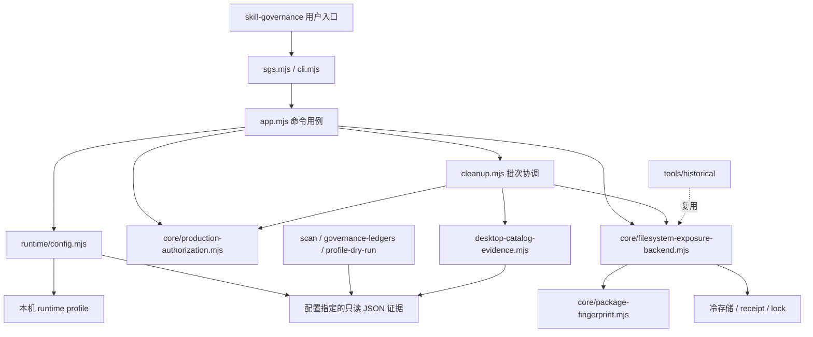

# SGS 架构

## 目标和运行边界

SGS 管理本机已经落地的 Skill 包与安装发现入口。它保留 Asset / Installation / Exposure 的区别，并通过精确 before state 和 receipt 实现可逆操作。包仓库、团队分发和全局路由不属于这个运行模块。

当前架构以运行代码、机器配置、历史证据、事务状态四个边界组织；目录中原有接口保留兼容入口。

领域单位：Asset 是完整包内容，Installation 是具体安装及链接关系，Exposure 是具体宿主实际观察到的入口。相同名称或入口哈希不证明完整包等价。

## 模块职责

| 层 | 文件 | 负责 | 边界 |
|---|---|---|---|
| 命令入口 | `src/sgs.mjs`、`src/cli.mjs` | 参数、profile 选择、JSON 输出与退出码 | 不硬编码机器路径或证据日期 |
| 应用用例 | `src/app.mjs` | status/audit/plan/inspect/apply/rollback/changes/verify、doctor/init | 通过配置读取证据，复用事务 backend |
| 批次协调 | `src/cleanup.mjs` | AUTO_CLEAN 阈值、Canary、精确授权、批次回滚和 Desktop 验收 | 调用同一个 backend；前批 PASS 才允许后批；不创建第二个移动引擎 |
| 运行配置 | `src/runtime/config.mjs` | 路径解析、artifact 名称映射、host binding、写入模式 | 相对 profile 路径；HOME/PROJECT 变量；新宿主未知 |
| 部署用例 | `src/deployment.mjs` | bootstrap、薄入口安装、pointer 重绑定、目录 staging | 复用现有 scanner/ledger/dry-run，不移动资产；新用户默认只读 |
| 通用输入 | `src/runtime/arguments.mjs`、`json.mjs` | 小型参数解析、BOM JSON、只读 receipt 容错 | 写命令遇损坏 receipt 仍拒绝；不引入第三方依赖 |
| 事务核心 | `src/core/filesystem-exposure-backend.mjs` | observe/plan/disable/rollback/verify、快照、锁、失败恢复 | 同卷 rename；根边界；完整包；拒绝并发覆盖 |
| 身份核心 | `src/core/package-fingerprint.mjs` | 整包内容及链接拓扑指纹 | 指纹规则只有一个实现，不导入历史分类脚本 |
| 授权核心 | `src/core/production-authorization.mjs` | 精确 target/before hash、执行授权、已消费拒绝 | 纯函数；不接触真实安装 |
| 只读构建 | `src/scan.mjs`、`build-governance-ledgers.mjs`、`profile-dry-run.mjs` | 显式 scope/input 的扫描和数据转换 | 不自动扫描或重新分类原库 |
| Desktop 观察 | `src/desktop-catalog-evidence.mjs` | 提取实际 Desktop catalog 的路径证据 | Windows 路径语义；不把 CLI 或 UI 同名当路径证明 |
| 部署工具 | `tools/export-portable.mjs`、`render-*.mjs` | 便携输出、入口 pointer、scope 文件 | 不自动安装/移动真实 Skill |
| 本机清理工具 | `tools/prepare-cleanup-baseline.mjs`、`close-cleanup-candidates.mjs` | 显式构建 baseline、绑定已有 candidate closure | 有独立参数入口；app 不自动执行，不把它们等同 status |
| 本机验收 harness | `tools/verify-cleanup-batch.mjs`、`entry-publication-evidence.mjs` | 当前两类 canonical smoke、YY entry load、独立发布差异解释，再调用既有批次验收 | 针对当前宿主/包布局，不随便携包发布，不新增移动引擎 |
| 历史工具 | `tools/historical/` | 14 个日期固定的诊断/导入/收官脚本 | 留在原机器；便携包排除；不会由 app 自动调用 |

`tools/restructure-local.mjs` 是已执行的首次重组脚本，已有 core 时拒绝重跑；它属于一次性维护记录，不是产品启动、迁移或恢复入口。`src/desktop-diagnostic-evidence.mjs` 支持旧诊断证据读取，不参与当前产品调用链。

## 调用链与改变位置

| 操作 | 调用链 | 可以改变什么 |
|---|---|---|
| `help/--help` | CLI → app commandHelp | 不加载 profile，展示命令及副作用 |
| `doctor/status/audit/inspect/changes` | CLI → app → runtime/artifacts/receipt | doctor 只读检查依赖；status 可读取已记录 session 的后续 catalog，不重启 Desktop或刷新 Skill 树 |
| `verify <ID>` | CLI → app → backend observe | 只读比较实际安装与 receipt；返回文件状态，不证明 Desktop 可见性 |
| `init` | CLI → app → defaultProfile | 仅创建不存在的本地 profile，默认只读 |
| `plan <ID>` | CLI → app → backend plan | 读取或准备具体 ChangeSet receipt；计划不授予 apply 权限 |
| `apply/rollback <ID>` | CLI → app → 同一个 backend；apply 另经精确授权 | 受对应 gate 约束的单个安装事务；rollback 比较当前状态 |
| `cleanup --safe` | CLI → app → 配置的 baseline | 无 batch 参数时仅列出当前候选；带 batch/authorization 时准备批次及 exact 授权 |
| `cleanup --apply/--verify/--rollback` | CLI → app → cleanup → backend/Desktop parser | 更新 batch 与原 ChangeSet；verify 失败可能触发仅本批 rollback，因此不是纯读取 |
| 显式 scan/ledger/profile 构建 | 独立 CLI → scanner / fingerprint / 输入 JSON | 写指定输出；不由 app 隐式运行 |

修改入口参数或 JSON 展示先定位 cli/app；修改批次策略先定位 cleanup；改变完整安装的移动与恢复语义先定位 backend。runtime 只处理配置与宿主绑定。core 不导入历史工具，构建脚本不复制事务实现。

## 唯一事实来源

- 运行路径及 artifact 文件选择：`.sgs.local.json`。不会在 app 中重复定义日期。
- 整包指纹规则：`src/core/package-fingerprint.mjs`。
- 事务状态：配置的 cold store 内 `changesets/<ID>.json`；不存在第二份安装数据库。
- 批次状态：同一 cold store 的 `batches/<batch-id>.json` 聚合原有 ChangeSet，保留 before、after、恢复计划和 Desktop 原始记录定位。
- 本机授权：配置的 authorization directory。迁移包不携带授权。
- 当前宿主能力：profile 指向的证据及匹配的 host binding。复制旧证据不会证明另一个宿主。
- 历史任务与签收：原工作区 `docs/`、`.tt-state/` 和原始输出；不改写路径来伪造跨机证据。

当前产品文档入口为 `README.md`、`CONTEXT.md`、`docs/README.md`、本架构文档和 `MIGRATION.md`。原 `implementation-entry.md` 只保留短索引；旧阶段 checkpoint 从这个活动入口退出，完整原文按项目洗澡 manifest 回取。计划、任务、契约和原始验收保留原路径。

## 发布与加载边界

`tools/export-portable.mjs` 的显式文件清单是发布范围的唯一来源，`PORTABLE-MANIFEST.json` 保存实际发布文件数与 SHA256。运行代码的相对模块依赖必须全部落在清单内；当前文档链接也应在便携目录可解析。

- `src/` 的稳定产品入口、core、runtime、scanner/ledger/profile，以及部署工具、模板和当前使用文档可以发布。
- `.sgs.local.json`、`.sgs/`、`outputs/`、`work/`、`.tt-state/`、authorization、receipt、cold assets、历史脚本及本机 smoke harness 不发布。
- `.agent-archive/` 不发布。`.ignore` 让常规 `rg` 遍历跳过冷归档和生成物；恢复读取指定 manifest 不依赖常规搜索。
- 这些措施分别证明源码搜索和便携导出的排除；其他外部索引器、Desktop Skill discovery 和已加载会话上下文没有因此被验证或清空。

便携包默认没有本机证据。新机器运行代码可用与 Desktop backend 支持是两个验收面，状态仍按新 profile 和新证据建立。

## 配置与安全

`host_binding` 是 platform、hostname、home、discovery roots 的 SHA256，用于识别误用的宿主 profile，不是签名或授权。用户手工编辑配置不能替代 Owner 授权或 Desktop 实测。

生产写入顺序：profile 允许写 → host binding 匹配 → 平台已验证 → 精确授权未消费 → Desktop backend PASS → target/canonical compare → 事务 lock → 同卷完整安装移出 → verify。rollback 保持原有 compare/冲突拒绝，不覆盖占用路径。

默认 profile 只读；当前原机器的兼容 profile 沿用原 cold store 和已消费的 SG-001 授权，不额外放开生产操作。

批量授权来自单独保存的本轮 Owner 指令及其 SHA256，准备时绑定每个 exact target、before state 和 canonical；旧 SG-001 已消费授权不复用。`cleanup --safe` 读取已显式刷新的 baseline，默认展示计划。实际 apply 需要批次 ID、授权记录和执行标志。初始批最多 10 个完整安装包，后续最多 25 个；没有 fresh Desktop evidence 时只记 `APPLIED_AWAITING_DESKTOP`。

统计保留四种单位：磁盘 `SKILL.md` 逻辑路径、真实目标、完整包事务、实际 Desktop 会话入口。容器一包可能含多个 nested Skill；一个 SDLC 目录移动对应一个 receipt、四个 exposure，不把这些单位相加。

## 兼容与尚未泛化部分

旧 `src/filesystem-exposure-backend.mjs` 与 `src/production-authorization.mjs` 重导出核心。旧一次性脚本路径转发到 `tools/historical`，用于读取历史命令，便携包不包含这些转发。

日期固定的 producer import / readiness / native reconciliation orchestration 仍是历史工具。本轮将其与运行入口隔离，没有把它们伪装成适用于任意机器的自动 producer 管理器。完整跨机 producer 适配、隐式路由和新平台 Desktop 写入仍待独立实现与验证。
