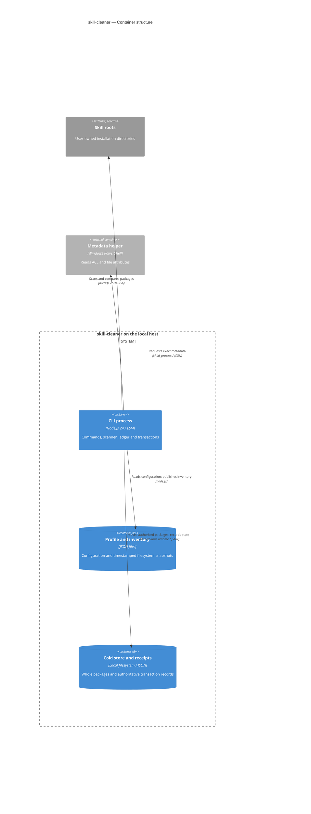

# 运行单元

这是当前本地 CLI 的 C4 Container 视图。文件存储使用存储图形表达，不代表数据库服务。scanner、ledger 和 backend 都在同一 Node 进程内。

[可编辑 Mermaid](c4-containers.mmd) · [兼容渲染](c4-containers.svg) · [Archify 静态预览](../../assets/diagrams/containers.png) · [交互文件](../../assets/diagrams/containers.html) · [可编辑 JSON](../../assets/diagrams/containers.json)

取证范围：公开版本的 app、deployment、runtime/config、scan 和 filesystem-exposure-backend。交互图每个节点都带固定提交的源码来源。更细的进程内职责在首页技术栈表中说明；没有分布式部署，无需额外 Deployment 视图。

